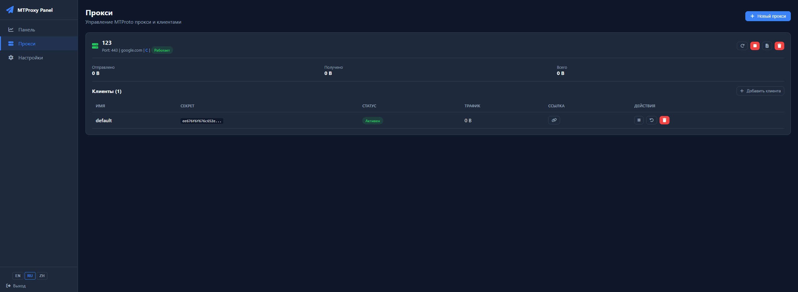

<div align="center">


**Веб-панель для управления MTProto прокси-серверами Telegram**

[](https://go.dev/)
[](https://www.docker.com/)
[](LICENSE)
[](#-telegram-bot)

[English](README_EN.md) | **Русский**

---



</div>

## Возможности

| | Функция | Описание |
|---|---|---|
| :chart_with_upwards_trend: | **Dashboard** | Мониторинг CPU, RAM, диска, сети в реальном времени |
| :shield: | **Мульти-прокси** | Несколько прокси-инстансов на разных портах |
| :busts_in_silhouette: | **Мульти-клиент** | Уникальные секреты, лимиты трафика, срок действия |
| :gear: | **Два движка** | Official C или telemt Rust — выбор при создании |
| :lock: | **Fake TLS** | Маскировка трафика под HTTPS |
| :globe_with_meridians: | **Auto-SSL** | Автоматические сертификаты Let's Encrypt |
| :robot: | **Telegram Bot** | Управление прокси прямо из Telegram |
| :link: | **Ссылки в 1 клик** | Автогенерация `tg://proxy` ссылок |
| :whale: | **Docker** | Каждый прокси = изолированный контейнер |
| :zap: | **Один бинарник** | Go, ~25 MB, без внешних зависимостей |

## Быстрый старт

### 1. Установка Docker

```bash
curl -fsSL https://get.docker.com | sh
systemctl enable --now docker
```

### 2. Запуск панели

```bash
git clone https://github.com/retroFWN/MTProto-ui.git
cd MTProto-ui
docker compose up -d --build
```

### 3. Открыть панель

```
http://IP_СЕРВЕРА:8080
```

| | |
|---|---|
| **Логин** | `admin` |
| **Пароль** | `admin` |

> :warning: **Смените пароль после первого входа!**

## Прокси-движки

| | Official (C) | telemt (Rust) |
|---|:---:|:---:|
| **Образ** | `telegrammessenger/proxy` | `whn0thacked/telemt-docker` |
| **Fake TLS** | v1 | v2 |
| **Per-user статистика** | :x: | :white_check_mark: |
| **Management API** | :x: | :white_check_mark: |
| **Динамические секреты** | :x: | :white_check_mark: |
| **Anti-replay** | :x: | :white_check_mark: |

## :robot: Telegram Bot

1. Создайте бота через [@BotFather](https://t.me/BotFather)
2. В **Настройках** панели вставьте токен и ваш Telegram ID
3. Нажмите **Сохранить**, затем **Запустить бота**

| Команда | Описание |
|---|---|
| `/proxies` | Список прокси |
| `/connect <id>` | Получить ссылки подключения |
| `/status <id>` | Статус прокси и клиентов |
| `/addclient <pid> <name> [gb] [days]` | Создать клиента |
| `/delclient <pid> <cid>` | Удалить клиента |

## Настройка

| Переменная | По умолчанию | Описание |
|---|---|---|
| `PANEL_PORT` | `8080` | Порт панели |
| `PANEL_DOMAIN` | — | Домен для auto-SSL |
| `SECRET_KEY` | авто | Ключ подписи JWT |
| `PROXY_BACKEND` | `official` | Движок по умолчанию |
| `DOCKER_HOST_IP` | `127.0.0.1` | IP Docker-хоста |

### Auto-SSL

```yaml
# docker-compose.yml
environment:
  - PANEL_DOMAIN=panel.example.com
ports:
  - "80:80"
  - "443:443"
```

## Обновление

```bash
cd /opt/MTProto-ui
git pull
docker compose up -d --build
```

## Стек

<table>
<tr><td><b>Backend</b></td><td>Go, Gin, GORM, SQLite</td></tr>
<tr><td><b>Frontend</b></td><td>HTML, CSS, Vanilla JS</td></tr>
<tr><td><b>Auth</b></td><td>JWT (HS256), bcrypt</td></tr>
<tr><td><b>Bot</b></td><td>Python, aiogram v3</td></tr>
<tr><td><b>SSL</b></td><td>Let's Encrypt (autocert)</td></tr>
<tr><td><b>Proxy</b></td><td>Docker containers</td></tr>
</table>

## Благодарности

- [3x-ui](https://github.com/MHSanaei/3x-ui) — вдохновение для дизайна панели
- [telegrammessenger/proxy](https://github.com/TelegramMessenger/MTProxy) — официальный MTProto прокси (C)
- [telemt](https://github.com/telemt/telemt) — Rust MTProto прокси

## Лицензия

[MIT](LICENSE)
